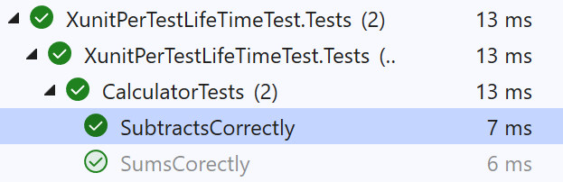
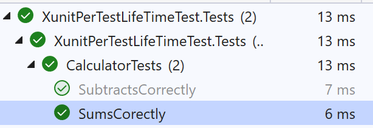
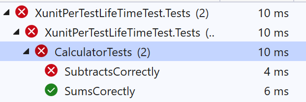

# XunitPerTestLifeTimeTest

## Build status

| GitHubActions Builds |
|:--------------------:|
|  |

## Problem explanation

If you run the tests separately they work:

If you run them together they don't:
